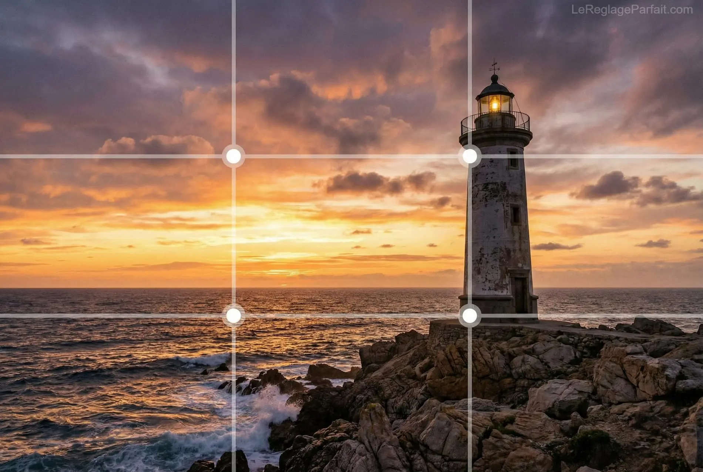
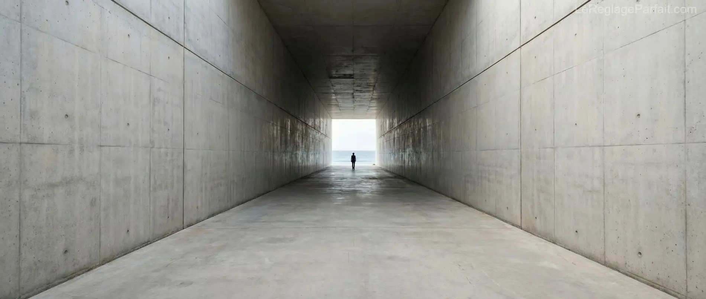
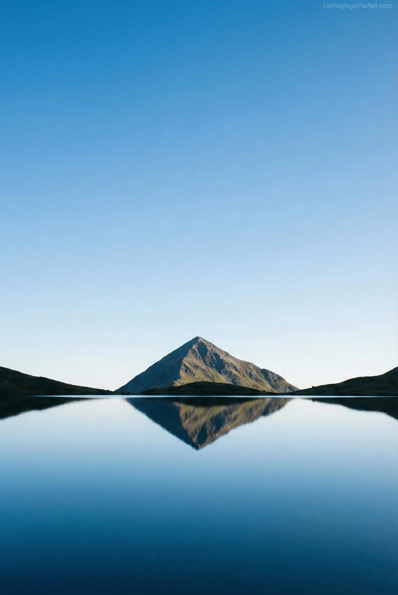

Après avoir choisi vos **[objectifs](/posts/guide-focale-fixe/)** et maîtrisé votre **[triangle d'exposition](/posts/triangle-exposition/)**, il reste l'élément le plus crucial : la **composition**. C'est l'art d'organiser les éléments dans votre cadre pour transformer une photo banale en une œuvre mémorable.

### 1. La Règle des Tiers : Le Fondement
C'est la règle la plus simple et la plus efficace pour briser la monotonie d'un sujet centré. Imaginez votre image divisée par deux lignes horizontales et deux lignes verticales.

* **Les Points Forts :** Placez votre sujet principal aux intersections de ces lignes pour créer un équilibre dynamique.
* **L'Horizon :** Ne coupez pas votre image en deux. Placez l'horizon sur la ligne du tiers inférieur (pour privilégier le ciel) ou supérieur (pour privilégier le sol).

**💡 Conseil Pro :** Utilisez un **[trépied stable](/posts/guide-trepied/)** pour prendre le temps de peaufiner votre cadrage au millimètre près.

---

### 2. Guider le Regard : Les Lignes Directrices
L'œil du spectateur doit être "conduit" naturellement vers votre sujet.

* **Profondeur :** Utilisez des routes, des rivières ou des structures architecturales pour créer un effet de perspective.
* **Dynamisme :** Les lignes diagonales partant des coins de l'image sont les plus puissantes pour attirer l'attention et donner de la vie à un paysage statique.

---

### 3. L'Équilibre Visuel : Symétrie et Espace Négatif
La composition, c'est aussi savoir gérer le vide.

* **La Symétrie :** Idéale pour l'architecture. Pour des reflets parfaits sur l'eau, n'oubliez pas d'utiliser un **[filtre polarisant](/posts/guide-filter/)** afin de supprimer les reflets parasites.
* **L'Espace Négatif :** Laissez de l'espace vide autour de votre sujet. Cela permet à l'image de "respirer" et renforce l'importance de l'élément central.

---

### 4. Ressources pour progresser (Affiliation)

#### 📚 La Bible du Cadrage : "L'œil du photographe" (M. Freeman)
C'est l'ouvrage de référence absolu pour comprendre la psychologie de l'image. Indispensable pour passer du stade d'amateur à celui d'artiste.

    <a href="https://amzn.to/3PBy3D0" style="background-color: #e67e22; color: white; padding: 12px 24px; text-decoration: none; border-radius: 5px; font-weight: bold; display: inline-block;" target="_blank" rel="sponsored">📖 Voir le livre sur Amazon</a>

---

## Conclusion

La technique vous donne la photo, mais la composition vous donne l'image. En appliquant ces règles simples, vous donnez une structure et un message à vos clichés. N'oubliez pas qu'une fois ces règles maîtrisées, le plus grand plaisir du photographe est de savoir quand les briser pour aff